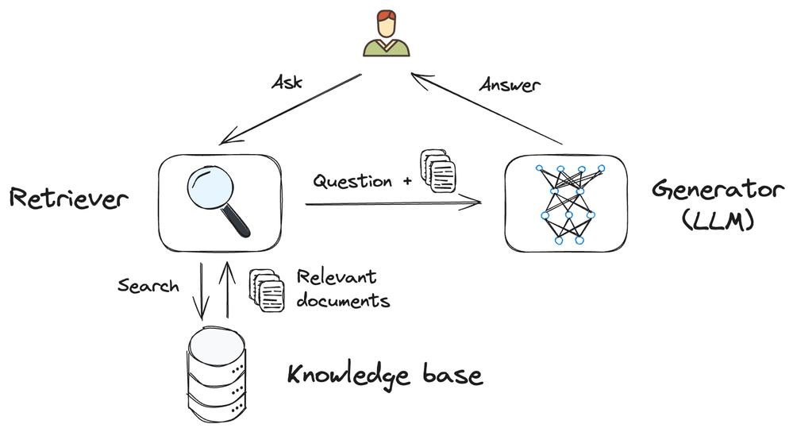

# Understanding the RAG (Retrieval Augmented Generation) architecture

In this section, we'll understand what the RAG (Retrieval Augmented Generation) architecture is, how it works, and why it's important for integration with AI models.

## What is RAG (Retrieval Augmented Generation)?

RAG is an architecture that integrates external information retrieval into the response generation process of Large Language Models (LLMs)

It allows searching for a specific database, in addition to the pre-trained knowledge base, to significantly improve the accuracy and relevance of answers.

In the business context, RAG architecture enables generative artificial intelligence (AI) to focus exclusively on company-relevant content. This allows AI to work with specific information, such as documents, vectorized images, and other types of business data. To achieve this, AI models must be capable of understanding and processing these specific types of content.

In simple terms, RAG architecture enables organizations to use AI to analyze and generate information from their specific data, including texts and images that are related to their business, in a controlled and targeted manner.

## RAG Architecture Components

Implement the standard RAG architecture following this flow. It should include:

1. **Ingestion:**

   - **How it works:** Indexing is the process of organizing data in a vector database to make it easily searchable. This critical step allows the RAG to access relevant information quickly when responding to a query.
   - **Mechanism:** Starts with the collection of documents, which are divided into smaller chunks by a **splitter**. Complex algorithms transform each piece of text into an embedding vector, which is then stored in the database for efficient retrieval of similar information.

2. **Retrieval:**

   - **How it works:** This process uses vector similarity search to find the most relevant documents or passages to answer a query.
   - **Mechanisms:**

     - **Sparse vector representations:** Use sparse vector representations to be texts through vectors that highlight specific characteristics of the data. These representations are called **sparse** because they tend to have many zero values, focusing only on specific aspects such as the presence of certain key words or phrases. This type of representation is useful for research based on specific terms but may not capture the full semantics of the text well.

     - **Dense vector embeddings:** Use language models to encode queries and passages in dense vectors, which are stored in vector databases and allow retrieval based on semantic similarity.

     - **Hybrid search:** Combines the techniques of keyword search and semantic search to take advantage of the strengths of both types of representations. Hybrid search improves the quality of results by maximizing relevance and precision of retrieved information.

3. **Generation:**
   - **How it works:** With the most relevant passages retrieved, the generator's task is to produce a final response, synthesizing and expressing this information in natural language.
   - **Mechanisms:** The generator, which is typically a model like GPT, BART, or T5, uses both the query and the relevant documents found by retriever to create its response. It is important to note that the generator relies on the retriever to find the relevant documents.

## Why is RAG architecture important for integration with AI models?

RAG architecture is useful for AI models in business contexts. It allows for flexible and efficient integration with various databases, improving the relevance and accuracy of generated responses while customizing the application to meet specific business needs.

Here are some advantages of integrating RAG architecture with AI models:

### Adapting the RAG Architecture to different Enterprise Databases

The RAG architecture can be configured to work with a variety of databases. It can adapt to access and incorporate information from various sources as needed. This is possible because the retrieval component of the architecture can interact with different data formats and structures, from traditional relational databases to document repositories or content management systems.

Examples of data types that can be integrated:

1. **Textual documents:** Internal documents, analysis reports, procedure manuals, and technical documentation. RAG can retrieve relevant information from these documents to answer specific questions that require detailed knowledge held there.

2. **Relational Databases:** Structured data such as customer records, financial transactions, and inventory records. Although traditionally not the focus of LLMs, by integrating RAG, AI models can extract and use information from tables and databases to enrich its answers or perform specific analyses.

3. **Social media data and customer feedback:** Comments and reviews that can be used to better understand market trends, consumer sentiment, and to answer questions related to customer service.

4. **Image and Video Databases:** Through descriptions or metadata associated with media, RAG can retrieve pertinent visual information to answer queries involving image identification or visual content analysis.

### Applications of RAG Across Industries

RAG has significant implications in many fields:

- **Legal Research:** Legal professionals can access and review relevant case laws and precedents quickly.

- **Medical Diagnosis:** Healthcare professionals can retrieve up-to-date patient records and research to support diagnosis and treatment plans.

- **Customer Support:** Service agents can provide responses based on the latest product information and manuals.

- **Market Analysis:** Analysts can use the latest market data and trends to support business decisions.

- **Educational Content:** Educators can update their materials with the latest research and studies to ensure relevance and accuracy.

> **Note:** To learn more about the RAG architecture, please refer to the official documentation of the Azure Cosmos DB Documentation service, which can be accessed [here](https://learn.microsoft.com/azure/cosmos-db/gen-ai/rag).

## Next Steps

RAG architecture is a powerful tool for improving the accuracy and relevance of AI models's responses. It makes AI models a more effective solution for business scenarios and other contexts where access to specific information is essential.

Now that we have a clear understanding of the RAG architecture, we can begin developing the functions for integration with AI models on the Front-end side. In the next section, we will start developing the `chat-post` function or the `chat` API for integration with AI models.

**[⬅️ Back: Setting Up the Serverless Environment using Azure Functions](02-setting-up-azure-functions.md)** | **[Next: Developing the `chat` API ➡️ ](./04-preparing-understanding-language-models.md)**
